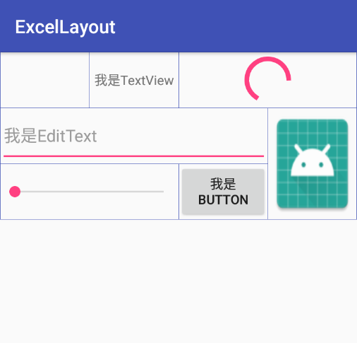

ExcelLayout
=========

## explain
一个简单又好用的表格Layout



注：由于是模拟器在PC端的截图，所以图中表格框会展示出粗细不一的情况。真机无此现象。

## How to use

### attrs:
```xml
    <declare-styleable name="ExcelLayout">
        <attr name="ELBorderColor" format="color" />  //边框颜色
        <attr name="ELStartX" format="integer" />     //开始的X坐标
        <attr name="ELStartY" format="integer" />     //开始的Y坐标
        <attr name="ELSpanX" format="integer" />      //View所占X轴的格数
        <attr name="ELSpanY" format="integer" />      //View所占Y轴的格数
    </declare-styleable>
```

### layout:
```xml
<com.vinnie.weight.ExcelLayout
    android:layout_width="match_parent"
    android:layout_height="wrap_content"
    app:ELBorderColor="@color/colorPrimary">

    <View
        android:layout_width="match_parent"
        android:layout_height="60dp"
        app:ELStartX="0"
        app:ELStartY="0"/>

    <TextView
        android:layout_width="match_parent"
        android:layout_height="match_parent"
        android:text="我是TextView"
        android:gravity="center"
        app:ELStartX="1"
        app:ELStartY="0"/>

    <ProgressBar
        android:layout_width="match_parent"
        android:layout_height="match_parent"
        app:ELStartX="2"
        app:ELStartY="0"
        app:ELSpanX="2"
        app:ELSpanY="1"/>

    <EditText
        android:layout_width="match_parent"
        android:layout_height="match_parent"
        android:hint="我是EditText"
        app:ELStartX="0"
        app:ELStartY="1"
        app:ELSpanX="3"/>

    <ImageView
        android:layout_width="match_parent"
        android:layout_height="match_parent"
        android:src="@mipmap/ic_launcher"
        android:scaleType="fitXY"
        app:ELStartX="3"
        app:ELStartY="1"
        app:ELSpanX="1"
        app:ELSpanY="2"/>

    <SeekBar
        android:layout_width="match_parent"
        android:layout_height="match_parent"
        app:ELStartX="0"
        app:ELStartY="2"
        app:ELSpanX="2"
        app:ELSpanY="1"/>

    <Button
        android:layout_width="match_parent"
        android:layout_height="match_parent"
        android:text="我是Button"
        android:gravity="center"
        app:ELStartX="2"
        app:ELStartY="2"/>


</com.vinnie.weight.ExcelLayout>
```

License
=======

    Copyright 2018 LVinnie

    Licensed under the Apache License, Version 2.0 (the "License");
    you may not use this file except in compliance with the License.
    You may obtain a copy of the License at

       http://www.apache.org/licenses/LICENSE-2.0

    Unless required by applicable law or agreed to in writing, software
    distributed under the License is distributed on an "AS IS" BASIS,
    WITHOUT WARRANTIES OR CONDITIONS OF ANY KIND, either express or implied.
    See the License for the specific language governing permissions and
    limitations under the License.


[](https://android-arsenal.com/details/1/1433)
